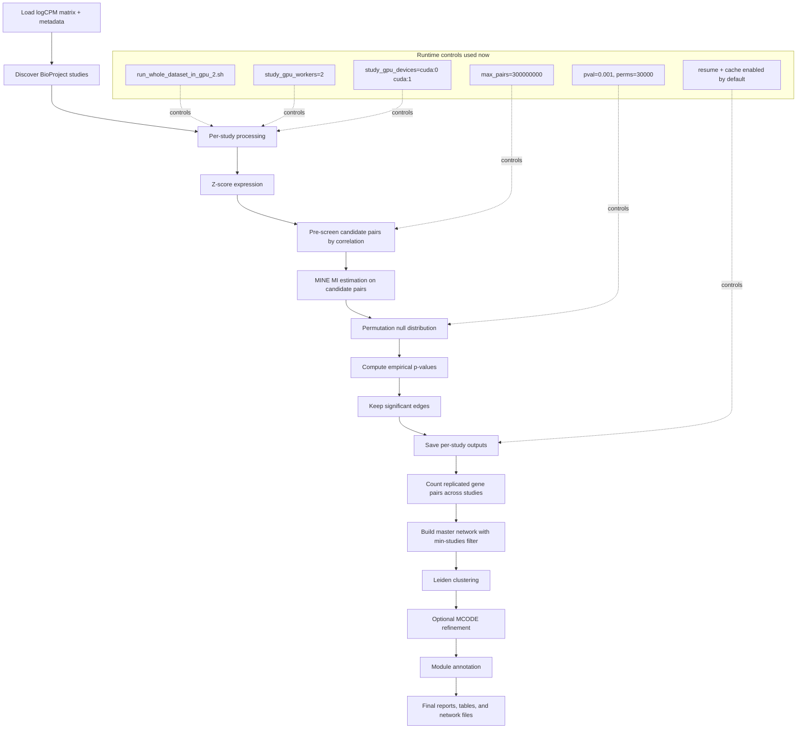

# Quick Start

This project builds multi-study gene co-expression networks from logCPM counts and metadata using a MINE-based mutual information workflow. In each study, it computes candidate gene-pair dependence, applies permutation significance testing, keeps significant edges, then aggregates replicated edges across studies into a master network. The master network is clustered with Leiden and optionally refined with MCODE, then modules are biologically annotated.

## Current Workflow (Wrapper-Based)

You are currently running the full workflow with the wrapper script so studies can run across two GPUs with resume and caching behavior.

- Wrapper: run_whole_dataset_in_gpu_2.sh
- Typical dual-GPU setup: study workers on cuda:0 and cuda:1
- Current max pairs target: 300000000
- Output folder pattern: output/wholde_dataset_in_gpu_2_300000000

## Pipeline Diagram

## Run With The Wrapper (Current Recommended Call)

    cd /data/users/mbotos/Environments/2026_2_25_PIGS_BTMS+/workingEnvironment/03_network/MINE_NETWORK_PERMUTATION_FILTER_MCODE_ANNOTATED
    MAX_PAIRS=300000000 STUDY_GPU_WORKERS=2 STUDY_GPU_DEVICES="cuda:0 cuda:1" BATCH_PAIRS=auto PVAL=0.001 PERMS=30000 NO_RESUME_STUDIES=0 NO_REUSE_MINE_SCORES=0 ./run_whole_dataset_in_gpu_2.sh

## Continue An Existing Run (Important)

Use the same OUTPUT_DIR and keep resume enabled:

    OUTPUT_DIR=/data/users/mbotos/Environments/2026_2_25_PIGS_BTMS+/workingEnvironment/03_network/MINE_NETWORK_PERMUTATION_FILTER_MCODE_ANNOTATED/output/wholde_dataset_in_gpu_2_300000000 MAX_PAIRS=300000000 STUDY_GPU_WORKERS=2 STUDY_GPU_DEVICES="cuda:0 cuda:1" NO_RESUME_STUDIES=0 NO_REUSE_MINE_SCORES=0 ./run_whole_dataset_in_gpu_2.sh

## Monitor

    nvidia-smi

    ls -t output/wholde_dataset_in_gpu_2_300000000/mine_network_*.log | head -1

    tail -f output/wholde_dataset_in_gpu_2_300000000/mine_network_YYYYMMDD_HHMMSS.log
